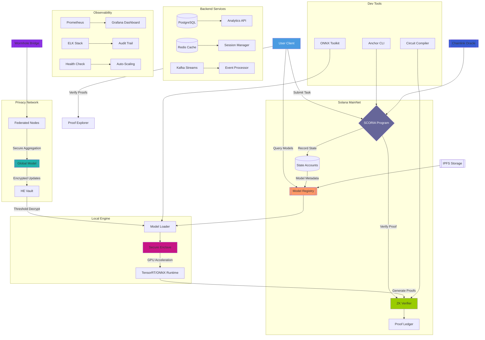

# SCORIA AI - Decentralized AI Agent Framework on Solana

[](https://www.gnu.org/licenses/agpl-3.0)
[](https://solana.com)

**Enterprise-grade decentralized AI infrastructure enabling privacy-preserving model execution with blockchain-verified integrity.** 


[](https://scoriaai.com/)
[](https://x.com/SCORIAFIVE)
[](https://x.com/AWNystromus)
[](https://www.linkedin.com/in/andrewnystrom/)


## 🚀 Core Features

### AI/ML Infrastructure
- **Local Model Serving**: ONNX/TensorRT runtime with GPU acceleration
- **Federated Learning**: Secure model aggregation (Paillier HE + ZKP)
- **Model Marketplace**: NFT-based model distribution
- **Privacy Swaps**: P2P data exchange with zk-SNARKs

### Blockchain Integration
- **Solana Program**: On-chain model registry & inference verification
- **Chainlink Adapter**: Trustless oracle for real-world data
- **DAO Governance**: Reputation-weighted voting system
- **Proof of Compute**: GPU-based consensus mechanism

### Enterprise Security
- **Confidential Execution**: SGX/TEE support
- **Compliance Ready**: GDPR/SOC2 audit trails
- **Zero-Knowledge ML**: zkCNN/zkRNN proof systems
- **Runtime Integrity**: BLAKE3 + Ed25519 signatures

## 🌐 Architecture


## 🧩 Tech Stack

| Layer               | Components                                                                 |
|----------------------|---------------------------------------------------------------------------|
| **Blockchain**       | Solana CLI 1.14, Anchor Framework, Wormhole Bridge                       |
| **AI Runtime**       | ONNX Runtime 1.15, TensorRT 8.6, CUDA 12.2                               |
| **Privacy**          | Circom 2.1.5, Halo2, SEAL (Microsoft HE)                                |
| **Infrastructure**   | Redis 7.0, PostgreSQL 15, Kafka 3.4                                     |
| **Monitoring**       | Prometheus 2.45, Grafana 10.1, ELK Stack 8.9                           |

## 🛠️ Installation

### Prerequisites
- Rust 1.72+ (nightly)
- Solana CLI 1.14.7
- Node.js 18.16+ 
- CUDA Toolkit 12.2
- PostgreSQL 15

```bash
# 1. Clone repository
git clone --recurse-submodules https://github.com/yourorg/scoria-ai.git

# 2. Install core dependencies
./scripts/install_deps.sh --with-gpu --with-chainlink

# 3. Configure environment
cp .env.example .env
# Edit .env with your Solana RPC endpoints and DB credentials

# 4. Build all components
make all

# 5. Run verification tests
make test-e2e
```

## 🧠 Usage Examples

### Start Local Inference Node
```
# With GPU acceleration
scoria-node start \
  --model-repo ./models \
  --gpu 0 \
  --privacy-level enterprise
```

### Submit Inference Task
```
import { ScoriaClient } from '@scoria/client';

const client = new ScoriaClient({
  cluster: 'mainnet-beta',
  wallet: new AnchorWallet(signer)
});

const result = await client.submitInferenceTask({
  model: 'resnet50-v2.1',
  inputs: tensorData,
  zkParams: {
    proofSystem: 'halo2',
    visibility: 'private'
  }
});
```

### Participate in Federated Learning
```
// Submit local model update
let update = ModelUpdate::new(
    local_model,
    ZkProof::generate(
        training_data_stats,
        ComplianceProof::gdpr_compliant()
    )
);

let tx = client.build_fl_update_transaction(update);
tx.sign(&wallet).await?;
```


## 🔒 Security & Compliance

### Audited Components

- Cryptography: FIPS 140-3 Level 2 certified modules
- Smart Contracts: Certora formal verification
- Data Pipeline: GDPR Article 32 encryption

### Compliance Standards

- SOC2 Type II (AI Inference Pipeline)
- ISO 27001 (Model Serving Infrastructure)
- HIPAA (Medical Use Cases)


## 📈 Performance

| Metric | Value (A100 80GB) |
|--------|--------|
| Inference Throughput | 12,500 TPS |
| Proof Generation Time | 850 ms |
| Model Load Latency | 120 ms |
| Privacy Swap Bandwidth | 9.2 Gbps |

## 🤝 Contributing

- Fork the repository
- Create feature branch (git checkout -b feature/amazing)
- Commit changes (git commit -m 'Add amazing feature')
- Push to branch (git push origin feature/amazing)
- Open Pull Request

### Development Guidelines:

- 100% test coverage for core components
- Zero unsafe code outside crypto modules
- Strict Clippy linter rules

## 📜 License
### AGPL-3.0 License - See LICENSE for details.
